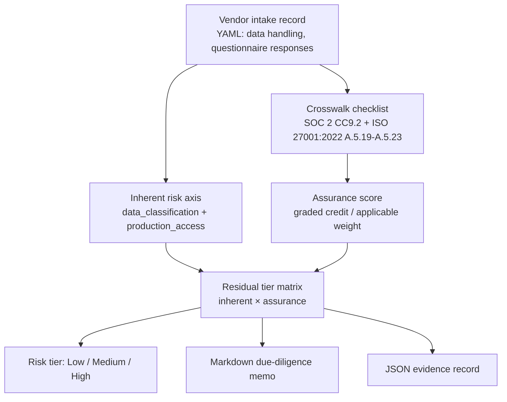

# Vendor Security Due Diligence

I score third-party SaaS vendors against SOC 2 and ISO 27001:2022 supplier-relationship controls. Independent certifications on file, external security rating tier, and data-handling profile go in. A Low/Medium/High risk tier, a markdown due-diligence memo, and a JSON evidence record come out. The point is a documented, repeatable risk-tier decision instead of "they have a SOC 2 report and a decent external rating."

> **Status:** v1.0 shipped. Crosswalk + intake-based risk scorer + audit-ready memo and evidence output.

## Impact

The manual alternative is a vendor tier decided in an email thread: someone confirms a SOC 2 report is on file, glances at an external rating, and writes "Low" in a spreadsheet cell with no record of what was weighed or how. At the next annual review, the reasoning has to be reconstructed or redone.

Here the same intake always produces the same tier, memo, and JSON evidence record (only the generation timestamp varies), with every checklist item mapped to the SOC 2 CC9.2 / ISO 27001 Annex A control it evidences. The re-review that used to start from scratch becomes a diff of this year's evidence record against last year's, and an incomplete intake fails loud (exit 2) instead of quietly producing a tier from partial answers.

## Architecture



Scoring is **two-axis**, not one blended number. The data-handling profile sets **inherent risk** (what is at stake if the vendor fails). The weighted checklist sets **assurance** (how much confidence the due-diligence answers provide). A config-driven matrix in `crosswalk.yaml` resolves the **residual tier**. Each checklist item maps back to SOC 2 CC9.2 and/or ISO 27001:2022 Annex A controls. The scorer emits both a human-readable memo (for the onboarding decision) and a machine-readable JSON record (for the audit trail).

## Compliance Controls Addressed

| SOC 2 | ISO 27001:2022 | How This Repo Validates |
|---|---|---|
| CC9.2 | A.5.19–A.5.22 | Checklist items score vendor/business-partner risk: data handling, certs on file, agreement terms, sub-processors, external rating, and ongoing monitoring (AICPA TSC: CC9.2) |
| CC9.2 | A.5.23 | Cloud/SaaS-only items (VDD-09, VDD-10) score shared-responsibility and residency/tenancy/key control disclosure |
| CC9.1 | *(none)* | Intentionally not mapped. AICPA CC9.1 is business-disruption / BCP-DR risk mitigation, not vendor risk |

## How an Auditor Uses This Output

An auditor reviewing SOC 2 CC9 or ISO 27001:2022 Annex A supplier-relationship evidence can pull the JSON evidence record directly. Inherent risk, assurance band, residual tier, certifications on file at time of assessment, and structured gap records are captured without manual transcription from an email thread or spreadsheet. The markdown memo is the human-facing artifact for the onboarding decision itself; the JSON record is what gets retained and re-reviewed at the next annual vendor reassessment cycle.

## Audit & Assurance Alignment

- Every vendor scored through this tool produces the same structured evidence record, regardless of who ran the assessment.
- Identical intake data always produces the same tier and memo. No hidden judgment calls buried in an unrecorded conversation. Only `metadata.generated_at` varies between runs.
- The JSON evidence record is designed to be diffed against a prior assessment of the same vendor, supporting periodic (e.g., annual) vendor risk re-review.

## Sample Evidence Output

Trimmed excerpt from `python score_vendor.py --intake sample_vendor.yaml` (full `item_results` omitted). `metadata.generated_at` is wall-clock only and omitted here.

```json
{
  "vendor": "Acme Cloud Analytics, Inc.",
  "assessed_date": "2026-07-27",
  "is_cloud_saas": true,
  "excluded_items": [],
  "inherent_risk": "Medium",
  "assurance_score": 78,
  "assurance_percent": 78.0,
  "assurance_band": "Adequate",
  "risk_tier": "Medium",
  "earned_points": 78.0,
  "applicable_points": 100,
  "certifications_on_file": ["ISO 27001"],
  "external_rating_tier": "C",
  "controls_referenced": [
    "SOC2-CC9.2",
    "ISO27001-A.5.19",
    "ISO27001-A.5.22",
    "ISO27001-A.5.20",
    "ISO27001-A.5.21",
    "ISO27001-A.5.23"
  ],
  "flagged_gaps": [
    {
      "id": "VDD-02",
      "credit": 0.8,
      "weight": 14,
      "controls": ["SOC2-CC9.2", "ISO27001-A.5.22"]
    },
    {
      "id": "VDD-04",
      "credit": 0.5,
      "weight": 10,
      "controls": ["SOC2-CC9.2", "ISO27001-A.5.22"]
    }
  ],
  "metadata": {
    "model": "inherent_x_assurance",
    "tool": "score_vendor.py"
  }
}
```

The high-risk sample (`sample_vendor_high_risk.yaml`, non-cloud) produces residual **High** with assurance **Weak**: `assurance_score` 28 from 23.3 of 84 earned points (CLI: `Weak (28/100, denom=84)`) with `excluded_items: ["VDD-09", "VDD-10"]`.

## Requirements

- Python 3.11+
- PyYAML

## Usage

```bash
pip install -r requirements.txt
python score_vendor.py --intake sample_vendor.yaml
python score_vendor.py --intake sample_vendor_high_risk.yaml --out-dir /tmp/vdd-high
```

Optional flags: `--crosswalk crosswalk.yaml` (default: `./crosswalk.yaml`), `--out-dir .` (default: current directory).

Outputs a due-diligence memo (`memo.md`) and a JSON evidence record (`evidence.json`) for the scored vendor. Incomplete intake records fail loud (exit 2). The tool does not emit a tier from partial answers.

## Repository Structure

```
vendor-security-due-diligence/
├── crosswalk.yaml                 # Due-diligence checklist + scoring policy (inherent × assurance)
├── score_vendor.py                # Intake record → residual tier + memo + evidence
├── sample_vendor.yaml             # Cloud/SaaS mid-range sample (denom 100)
├── sample_vendor_high_risk.yaml   # Non-cloud high-risk sample (denom 84)
├── requirements.txt
├── LICENSE
└── README.md
```

## Future Enhancements

- ISO/IEC 42001 (AI vendor governance) checklist extension
- CSA STAR self-assessment crosswalk for cloud-specific vendors
- Batch scoring across a vendor portfolio with a summary risk-distribution report

## References

- [AICPA SOC 2 Trust Services Criteria](https://www.aicpa-cima.com/resources/landing/system-and-organization-controls-soc-suite-of-services)
- [ISO/IEC 27001:2022](https://www.iso.org/standard/27001)

## License

MIT. See [LICENSE](LICENSE).
