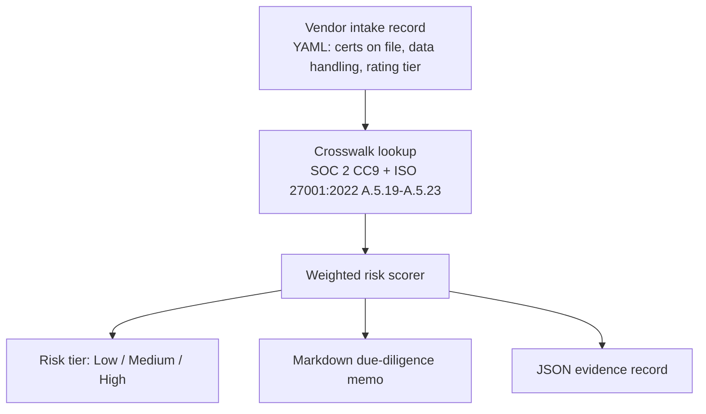

# Vendor Security Due Diligence

A vendor risk crosswalk and scoring tool for evaluating third-party SaaS vendors against SOC 2 and ISO 27001:2022 supplier-relationship controls — turning "do they have a SOC 2 report and a decent external security rating" into a documented, repeatable risk-tier decision.

> **Status:** v1.0 in development. Scope: crosswalk + intake-based risk scorer + audit-ready memo output.

## Why This Exists

Security assurance teams onboarding new vendors need more than a gut check on a SOC 2 report and a BitSight score — they need a repeatable, auditable method for turning vendor due-diligence inputs into a risk tier and an onboarding decision. This repo models that decision as structured data: independent certifications on file, external security rating tier, and data-handling profile go in; a Low/Medium/High risk tier and a markdown due-diligence memo come out, with a JSON evidence record for the audit trail.

Built while preparing for a Senior Security Assurance Analyst role whose "Vendor Management (Security Assurance)" responsibility names exactly this workflow — security due diligence on new and existing vendors, evaluating data handling, independent certifications, and external ratings like BitSight to support onboarding decisions.

## Architecture Overview



A vendor intake record is scored against a weighted rule set derived from the crosswalk — each checklist item maps back to a specific SOC 2 or ISO 27001:2022 control. The scorer emits both a human-readable memo (for the onboarding decision conversation) and a machine-readable JSON record (for the audit trail).

## Compliance Controls Addressed

| SOC 2 | ISO 27001:2022 | How This Repo Validates |
|---|---|---|
| CC9.1 | A.5.19, A.5.20 | Intake schema requires vendor risk-identification fields (data processed, storage location, supplier agreement terms) before scoring can run |
| CC9.2 | A.5.21, A.5.22 | Risk-tier output is the documented mitigation decision — the memo records why a vendor scored Low/Medium/High |
| — | A.5.23 | Cloud-service-specific checklist item scores cloud vendors on security posture disclosure, not just general supplier terms |

## How an Auditor Uses This Output

An auditor reviewing SOC 2 CC9 or ISO 27001:2022 Annex A supplier-relationship evidence can pull the JSON evidence record directly — each vendor's risk tier, the certifications on file at time of assessment, and the checklist items that drove the score are captured without manual transcription from an email thread or spreadsheet. The markdown memo is the human-facing artifact for the onboarding decision itself; the JSON record is what gets retained and re-reviewed at the next annual vendor reassessment cycle.

## Audit & Assurance Alignment

- **Repeatable evidence, not ad hoc judgment calls:** every vendor scored through this tool produces the same structured evidence record, regardless of who ran the assessment.
- **Deterministic scoring:** identical intake data always produces the same tier and memo — no hidden judgment calls buried in an unrecorded conversation.
- **Reassessment-ready:** the JSON evidence record is designed to be diffed against a prior assessment of the same vendor, supporting periodic (e.g., annual) vendor risk re-review.

## Sample Evidence Output

```json
{
  "vendor": "example-vendor",
  "assessed_date": "2026-08-01",
  "risk_tier": "Medium",
  "score": 62,
  "certifications_on_file": ["SOC 2 Type II"],
  "external_rating_tier": "B",
  "controls_referenced": ["SOC2-CC9.1", "SOC2-CC9.2", "ISO27001-A.5.19", "ISO27001-A.5.21"],
  "flagged_gaps": ["No ISO 27001 certification on file"]
}
```

## Requirements

- Python 3.11+
- PyYAML

## Usage

```bash
python score_vendor.py --intake sample_vendor.yaml
```

Outputs a due-diligence memo (`memo.md`) and a JSON evidence record (`evidence.json`) for the scored vendor.

## Repository Structure

```
vendor-security-due-diligence/
├── crosswalk.yaml           # SOC 2 CC9 + ISO 27001:2022 A.5.19-A.5.23 due-diligence checklist
├── score_vendor.py          # Intake record -> risk tier + memo + evidence record
├── sample_vendor.yaml       # Example vendor intake record
├── LICENSE.txt
└── README.md
```

## Future Enhancements

- ISO/IEC 42001 (AI vendor governance) checklist extension
- CSA STAR self-assessment crosswalk for cloud-specific vendors
- Batch scoring across a vendor portfolio with a summary risk-distribution report

## What This Project Demonstrates

Cross-framework crosswalk construction (SOC 2 ↔ ISO 27001:2022) applied to third-party vendor risk — the same methodology as this portfolio's federal cross-framework work (NIST 800-53 ↔ FedRAMP ↔ CJIS v6.0), retargeted at a commercial security assurance vendor-management workflow. Demonstrates translating a compliance requirement into a deterministic, auditable scoring model rather than an unstructured judgment call.

## References

- [AICPA SOC 2 Trust Services Criteria](https://www.aicpa-cima.com/resources/landing/system-and-organization-controls-soc-suite-of-services)
- [ISO/IEC 27001:2022](https://www.iso.org/standard/27001)

## License

MIT
